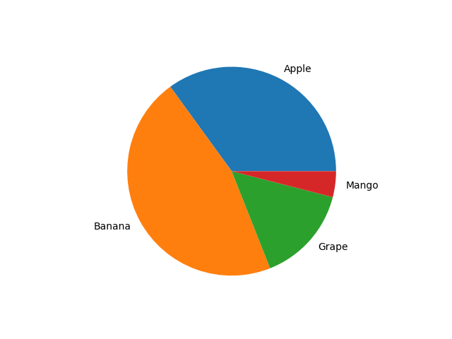
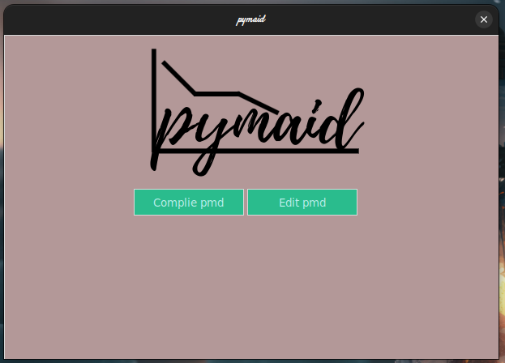
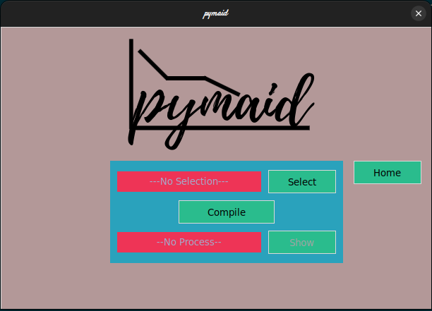
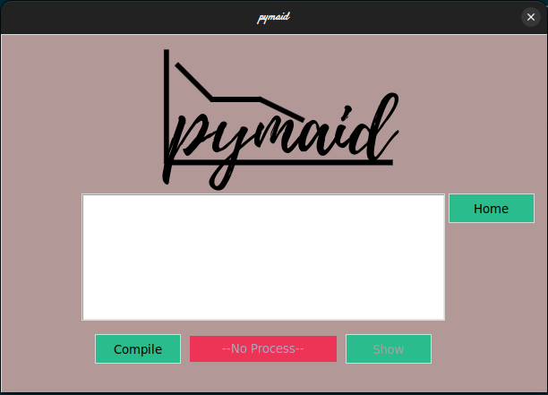
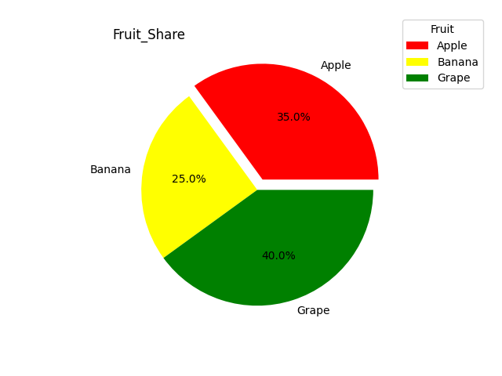
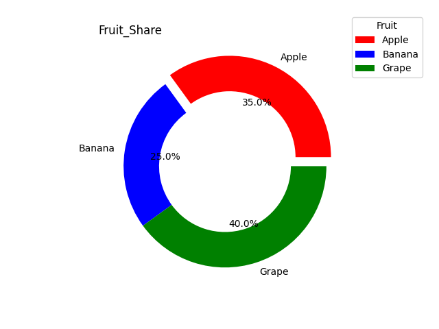
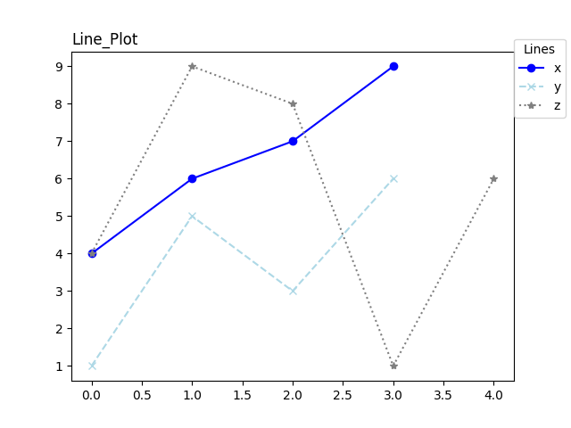
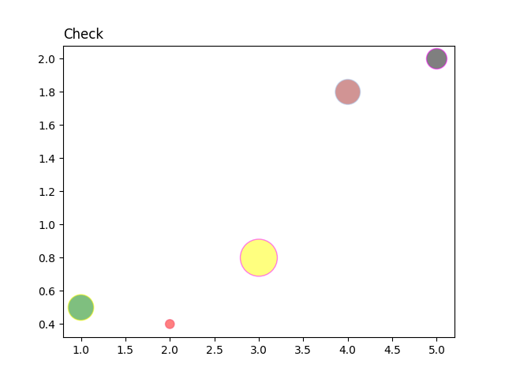

# `pymaid` : A `mermaid` inspired charting tool

`pymaid` is a simple charting tool which uses `matplotlib` to
plot charts. It enlace the user with a markdown like format
for creating quick plots. 

### Code Snippet
```Python
Pie
Apple 35
Banana 46
Grape 15
Mango 4
```
### Output:


### To Do
- [x] Line Plots
- [x] Pie Charts
- [x] Bar Plot
- [x] Scatter Plots
- [ ] Flowcharts
- [ ] Documentation (underway)
- [ ] GUI Application
- [x] Comment Support

### GUI 
A GUI for the application is under development with the tool itself.
A few screenshots of the GUI are hereby included:

Main Window                              | Compile Window 
:---------------------------------------:|:--------------------------------:
   |
Editor Window                            |


### Documentation
To use `pymaid` clone the repo and then create a `.pmd' file with the 
figure rules/syntax.
To get the figure run:
```Python
python3 main.py file.pmd
```

#### Comments
Comments are an important feature in programming languages but are not solely limited
to them but are pretty useful wherever there is place for ambiguity to occur.
It is pretty basic feature yet it took me quite some time to think of a way to parse these 
comments. Even though I am not sure if my current solution will break or not but I am glad that I
was able to code this one method of parsing comments.
##### How to use comments
Comments in `pymaid` start with a `#` and will end wherever a new line is found after the `#` symbol.
A `#` within quotes as in `'#'` and `"#"` are considered as strings and hence ignored.
```pmd
# this is a comment
Line Sales # this is also a comment
"#Rice" 2015,2016,2017,2018 50,60,55,80 # "#Rice" is not a comment but this is
```
Some basic plot syntaxes:

#### Pie Chart
##### Syntax:
```Syntax
Pie Figure_Title(without spaces, optional) Legend_Title(without spaces, optional)
Label1 Percentage Color(optional) Explode (optional)
Label2 Percentage Color(optional) Explode (optional)
Label4 Percentage Color(optional) Explode (optional)
Label5 Percentage Color(optional) Explode (optional)
```

##### Example:
```pmd
Pie Fruit_Share Fruit
Apple 35 Red 0.1
Banana 25 Yellow
Grape 40 Green
```
##### Output:


#### Donut
##### Syntax:
```Syntax
Donut Figure_Title(without spaces, optional) Legend_Title(without spaces, optional)
Label1 Percentage Color (optional) Explode (optional) 
Label2 Percentage Color (optional) Explode (optional)
Label4 Percentage Color (optional) Explode (optional)
Label5 Percentage Color (optional) Explode (optional)
```

##### Example:
```pmd
Donut Fruit_Share Fruit
Apple 35 Red 0.1
Banana 25
Grape 40 Green
```
##### Output:


#### Line Plot
Line plots can be dra_wn in two ways. Multiple plots with single lines and a single plot with multiple lines.
To draw mulitple plots the syntax is:
##### Syntax:
```Syntax
Line Figure_Title(without spaces, optional) SeparateOrNot(1 if yes, default 0) Legend_Title(without spaces, optional)
X_Label X_Points Y_Label Y_Points Marker(optional) Linestyle(optional) Color(Optional)
Xn_Label Xn_Points Yn_Label Yn_Points Marker_n(optional) Linestyle_n(optional) Color_nOptional)
```

Syntax to draw single plot with multiple lines:
```Syntax
Line Figure_Title(without spaces, optional) SeparateOrNot(0 for no, default 0)
X_Label X_Points Y_Label Y_Points Group_Label Marker(optional) Linestyle(Optional) Color(Optional)
```

##### Example:
```pmd
Line Line_Plot Lines
x 4,6,7,9 o - Blue 
y 1,5,3,6 x -- Lightblue
z 4,9,8,1,6 * : Grey
```

##### Output:


#### Bar Plot
##### Syntax:
```Syntax
Bar Figure_Title(without spaces, optional) Legend_Title(without spaces, optional)
Label X_Points(comma separated, without space) Y_Points(comma separated, without space) Color(optional) Width (optional) Edge-color(optional)
```

##### Example:
```pmd
Bar Sales 
Sales 2012,2014,2015,2016 60,40,100,80 Red
```

#### Scatter Plot
##### Syntax:
```Syntax
Scatter Figure_Title(without spaces, optional) # Legend_Title(without spaces, optional)
X_Points(comma separated, without space) Y_Points(comma separated, without space) Colors(comma separated, optional) EdgeColors(comma separated, Optional) Alpha(comma separated, Optional)
```
##### Example:
```pmd
Scatter Check
1,2,3,4,5 0.5,0.4,0.8,1.8,2 Green,Red,Yellow,Brown,Black #2a8dce,#2becff,#3defce,#3344fd,#2896a1 0.9,0.4,0.6,0.7,0.9
```

##### Output:
